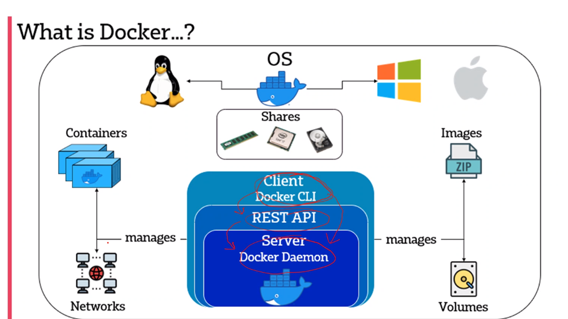

# Containerisation  
- It creates an abstraction at OS level that allows individual, modular and distinct functionality of the app to run independently
- a unit of software that is lightweight but still bundles the code, its dependencies 

## Containerisation vs Virtualisation
- Contains everything for the app to work with part of the host os, only shares the kernel, should be same type of OS, windows etc
- Cant run a one OS container on a different OS host (linux container on a Windows OS)
    - Unless you install the linux kernel on Windows
# Docker
## What is docker
- A containerisations system where you have containers in the OS that shares the RAM, CPU

Name |What it shows|Example|
|:---------: |:----------------------------: |:--------: |
|Docker run | runs a container, it = interactive terminal, bash = bash shell | Docker run -it ubuntu bash|
| Docker ps | shows active containers # -a shows all of the containers including the stopped ones |  | 
| Docker kill NAME | # kills the container immediately |  | 
| Docker stop NAME | # ends the container gracefully |  | 
| Docker start NAME |# starts the container, even if its been killed |  | 
| Docker exec -it NAME bash |# telling docker that NAME container is open and a shell should be started |  | 
| Docker rm NAME |# removes the container, can only be removed if the container has been stopped |  | 
When in bash shell, use ‘exit’ to stop the shell