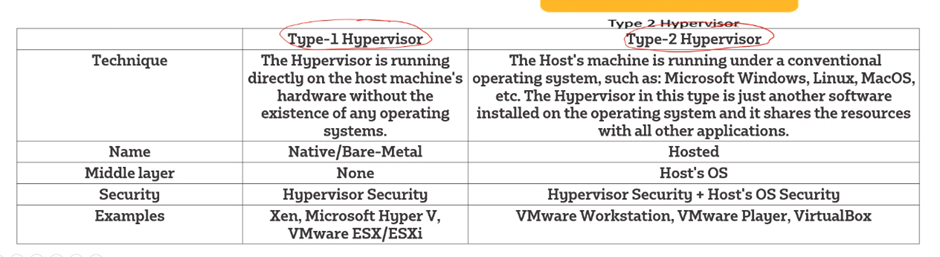

# Virtualisation
## What is virtualisation
- Is the process of separating a software from the hardware
- Separating software from the hardware.
- Mimicked the hardware as the software

# Vagrant
## What is Vagrant

Manages virtual machines
Loads it own VM to prevent clashes within software specified for the project, then saves the contents to the physical drive.
it creates its own vm but has the files accessible to the physical system, preventing crossovers between different software’s, so when the files are shared they can be loaded up and be ran successfully, because the vagrant file mimics the environment that it will feature on
Command prompt:
Mkdir test_vagrant  # creates file
Cd test_vagrant  # changes current directory
Vagrant  # 
Vagrant init hashicorp/bionic64  # bionic64 is the code name for ubuntu 64
Dir
Notepad vagrantfile
Vagrant up  # start vm command

Vagrant ssh
Ls /vagrant/

Vagrant destroy  # destroys the vm

Virtualisation 
Hypervisor is a vm monitor, works as a interface between the host and the vms (virtual box is a hypervisor)
Virtualisation types 
Type 1 - hardware -> hypervisor -> os & app
More secure than type 2 (has less layers, less potential risks)
Type 2 – hardware -> host OS -> hypervisor -> os & app
Host and virtual os share nothing
	
Vagrant
Its an automation tool for building and managing virtual machine environments in a single work flow. Helps with the automation of the environment
It uses a hypervisor, not a hypervisor nor a vm

Why do we need it
To allow for users to have the same vm from the vagrant file, 
eliminates the “it works on my machine” excuse as everyone will be uses the same environment
